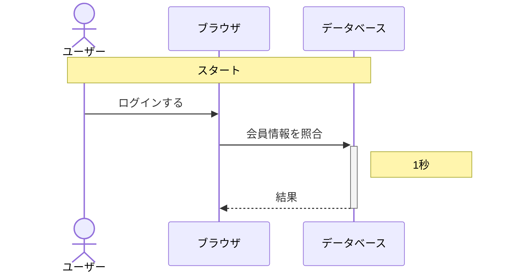

```mermaid
sequenceDiagram
    actor A as ユーザー
    participant B as ブラウザ
    participant C as データベース

    Note over A,C: スタート

    A->>B:ログインする
    B->>+C:会員情報を照合
    Note right of C: 1秒
    C-->>-B:結果
```
